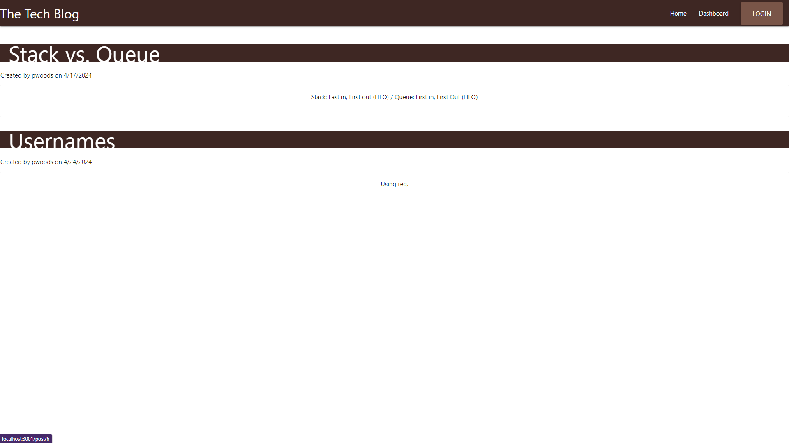
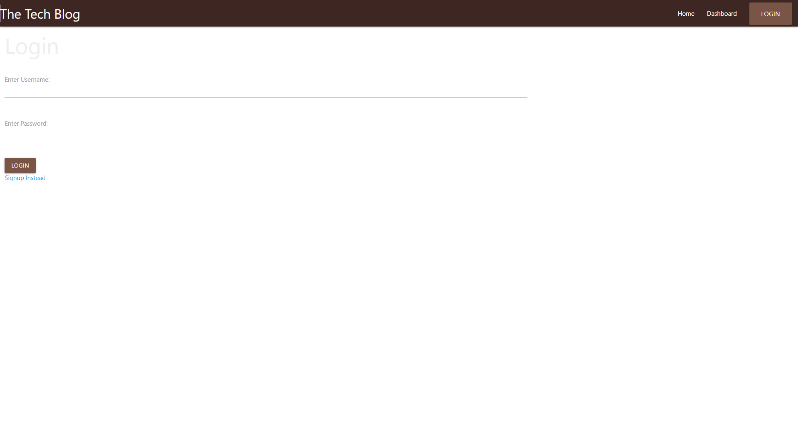
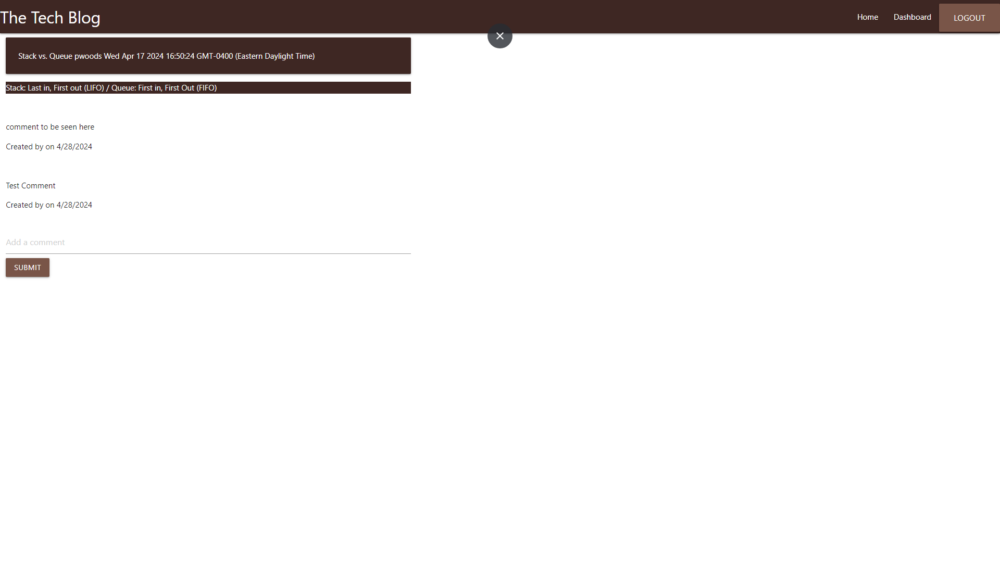
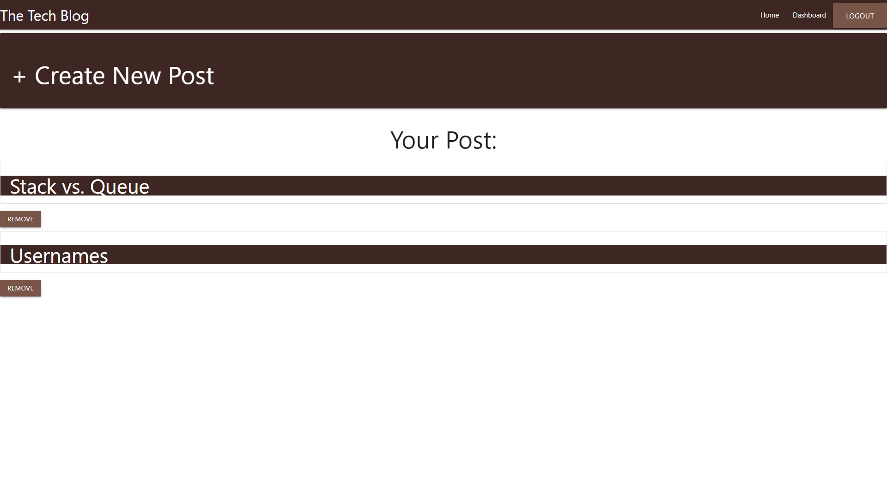
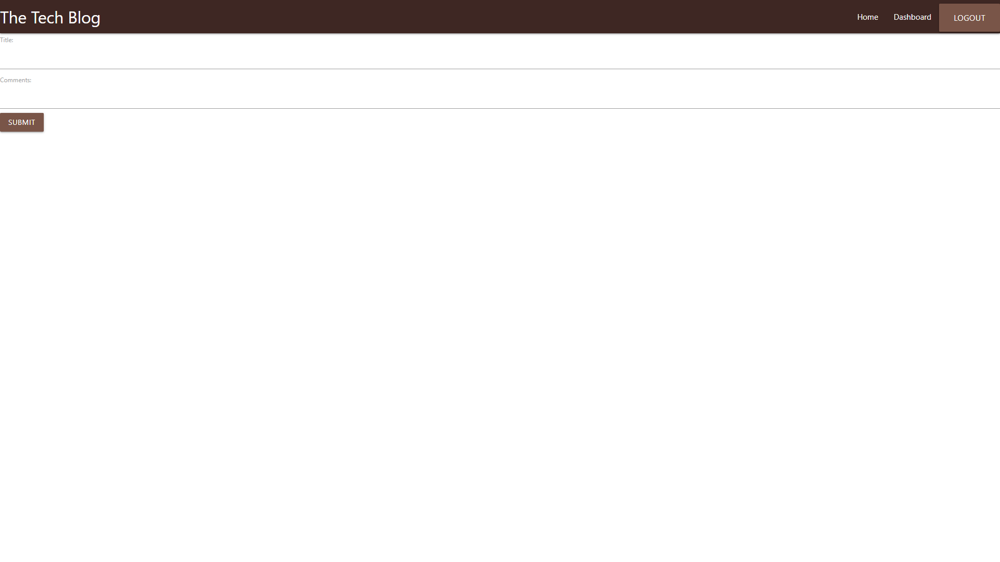

# Share-A-Bytes
A forum or blog site for tech based discussions. 

## Description
Internet forums or messaged boards are great ways of conversing with other indiviuals with a particular interest in a specific topic. Share-A-Bytes is a tech based forum, that allows for individual posting of tech topics and socializing or discussing using comments. 

## Installation Requirements
This application requires the use of various npms including bcrypt, connest-session-sequelize, dotenv, eslint-config-wesbos, express, express-handlebars, express-session, materialize-css, mysql2, nodemon, and sequelize.

## Usage
Click on the login button and enter a valid username and password. If no username and password was created, select the “signup instead” underneath the login button and follow the prompts. When logged in, view any post on the homepage. Click on a post to leave a comment. Click on “dashboard” in the navigation bar to access the user dashboard. Click on “Create New Post” to create a post that will display on the homepage for other users to view or comment. Every post a user creates will also display to the dashboard, which shows that users post and allows them to remove any post they no longer want. When finished on the application, click the logout button on the top right corner of the navigation bar. 

### Link to Deployed Application
https://glacial-badlands-72391-2827e5e69761.herokuapp.com/

### Screenshots

